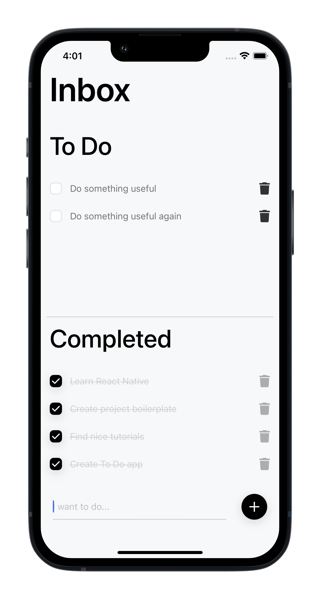

#  A To Do app done by (React Native)

<p align="center">
  
</p>

## About the SWEP  Project

 It is a React Native To Do application created for SWEP project.

You can add tasks, delete them and mark as done.

### Built With

- Expo
- React Native
- Redux
- Redux Toolkit
- Redux Persist
- Husky
- Prettier

All taught during the SWEP programme in my uni.

## Installation and Usage
First, npm install

To make the pre-commit hook work, you need to run `npm install` when the project is already initialized as a Git repository.

If the project is initialized as a repository later, you need to additionally execute `npm run prepare
and also to run the application, use npm start.
```
Enjoy!
